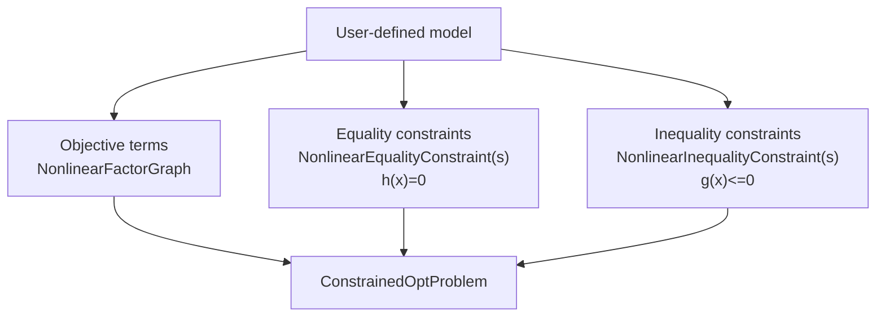
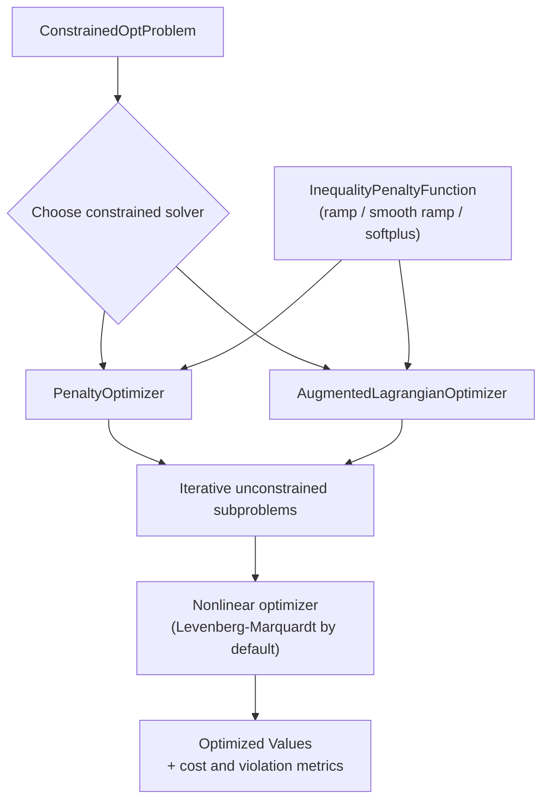

# Constrained

The `constrained` module in GTSAM provides constrained nonlinear optimization on top of factor graphs.
It includes classes for representing constraints, building constrained problems, and solving them with penalty and augmented Lagrangian methods.

## Core Problem Model

- `ConstrainedOptProblem`: Holds objective costs, equality constraints, and inequality constraints.
- `ConstrainedOptProblem::AuxiliaryKeyGenerator`: Generates keys for auxiliary variables used when transforming inequality constraints.
- `NonlinearConstraint`: Base class for nonlinear constraints represented as constrained `NoiseModelFactor` objects.

## Equality Constraints

- `NonlinearEqualityConstraint`: Base class for constraints of the form `h(x) = 0`.
- `ExpressionEqualityConstraint<T>`: Equality constraint from an expression and right-hand side.
- `ZeroCostConstraint`: Equality constraint that enforces zero residual on a cost factor.
- `NonlinearEqualityConstraints`: Container graph for equality constraints.

## Inequality Constraints

- `NonlinearInequalityConstraint`: Base class for constraints of the form `g(x) <= 0`.
- `ScalarExpressionInequalityConstraint`: Scalar expression-based inequality constraint.
- `NonlinearInequalityConstraints`: Container graph for inequality constraints.
- `InequalityPenaltyFunction`: Interface for ramp-like penalty mappings used with inequality constraints.
  Derived classes:
  - `RampFunction`
  - `SmoothRampPoly2`
  - `SmoothRampPoly3`
  - `SoftPlusFunction`

## Optimizers

- `ConstrainedOptimizerParams`, `ConstrainedOptimizerState`, `ConstrainedOptimizer`: Shared base interfaces and iteration state for constrained solvers.
- `PenaltyOptimizerParams`, `PenaltyOptimizerState`, `PenaltyOptimizer`: Penalty method solver and its parameters/state.
- `AugmentedLagrangianParams`, `AugmentedLagrangianState`, `AugmentedLagrangianOptimizer`: Augmented Lagrangian solver and its parameters/state.

## How the Pieces Fit Together

For a new user, it helps to think in two phases:

1. Build a constrained problem.
2. Run a constrained solver on that problem.

Inequality constraints can use different smooth penalty shapes via
`InequalityPenaltyFunction` (ramp, smooth polynomial ramps, or softplus),
which controls behavior near the active constraint boundary.

### 1) Build the Problem

This stage is about modeling: you separate what you want to minimize
(objective terms) from what must hold (constraints), then combine them into a
single `ConstrainedOptProblem` object that the solvers can consume.

### 2) Solve the Problem

This stage is algorithmic: pick a constrained solver, form iterative
unconstrained subproblems internally, and solve those subproblems with a
standard nonlinear optimizer until constraint violation and cost are reduced.

