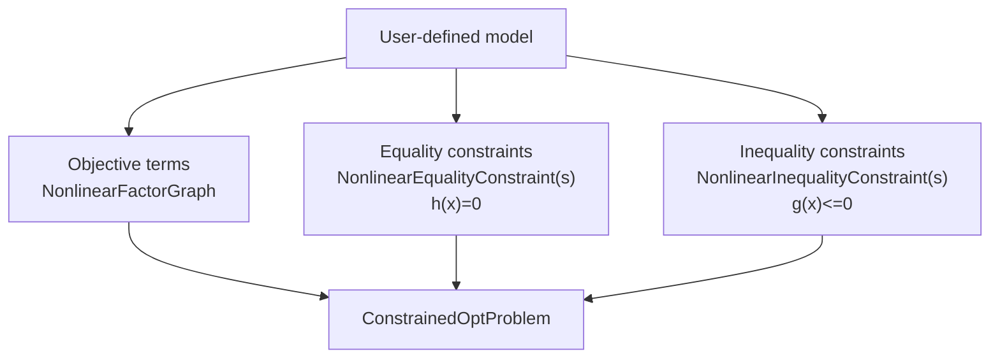
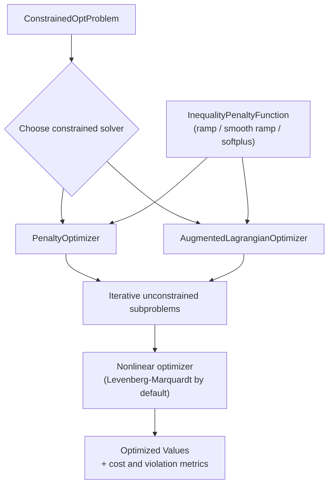

# Constrained

The `constrained` module in GTSAM provides constrained nonlinear optimization on top of factor graphs.
It includes classes for representing constraints, building constrained problems, and solving them with penalty and augmented Lagrangian methods.

## Core Problem Model

- [`ConstrainedOptProblem`](doc/ConstrainedOptProblem.ipynb): Holds objective costs, equality constraints, and inequality constraints.
- [`ConstrainedOptProblem::AuxiliaryKeyGenerator`](doc/ConstrainedOptProblem.ipynb): Generates keys for auxiliary variables used when transforming inequality constraints.
- [`NonlinearConstraint`](doc/NonlinearConstraint.ipynb): Base class for nonlinear constraints represented as constrained `NoiseModelFactor` objects.
- [`QpProblem`](doc/QpProblem.ipynb): Quadratic programs with affine quadratic costs and linear constraints over direct `Vector` and `Matrix` values, including guidance on sparse versus dense active-set subproblems.
- [`LpProblem`](doc/LpProblem.ipynb): Linear programs with linear costs and linear constraints over direct `Vector` and `Matrix` values.

## Equality Constraints

- [`NonlinearEqualityConstraint`](doc/NonlinearEqualityConstraint.ipynb): Base class for constraints of the form `h(x) = 0`.
- [`ExpressionEqualityConstraint<T>`](doc/NonlinearEqualityConstraint.ipynb): Equality constraint from an expression and right-hand side.
- [`ZeroCostConstraint`](doc/NonlinearEqualityConstraint.ipynb): Equality constraint that enforces zero residual on a cost factor.
- [`NonlinearEqualityConstraints`](doc/NonlinearEqualityConstraint.ipynb): Container graph for equality constraints.

## Inequality Constraints

- [`NonlinearInequalityConstraint`](doc/NonlinearInequalityConstraint.ipynb): Base class for constraints of the form `g(x) <= 0`.
- [`ScalarExpressionInequalityConstraint`](doc/NonlinearInequalityConstraint.ipynb): Scalar expression-based inequality constraint.
- [`NonlinearInequalityConstraints`](doc/NonlinearInequalityConstraint.ipynb): Container graph for inequality constraints.
- [`InequalityPenaltyFunction`](doc/InequalityPenaltyFunction.ipynb): Interface for ramp-like penalty mappings used with inequality constraints.
  Derived classes:
  - [`RampFunction`](doc/InequalityPenaltyFunction.ipynb)
  - [`SmoothRampPoly2`](doc/InequalityPenaltyFunction.ipynb)
  - [`SmoothRampPoly3`](doc/InequalityPenaltyFunction.ipynb)
  - [`SoftPlusFunction`](doc/InequalityPenaltyFunction.ipynb)

## QP and QCQP Problems

- [`QpProblem`](doc/QpProblem.ipynb): Holds affine quadratic costs and linear equality/inequality constraints over vector or matrix variables.
- [`QpCost`](doc/QpProblem.ipynb): Affine quadratic objective term backed by a Hessian factor.
- [`LinearConstraint`](doc/QpProblem.ipynb): Linear constraint represented as equal, less-equal, or greater-equal.
- [`ActiveSetSolver`](doc/QpProblem.ipynb): Active-set QP/LP solver with sparse and dense QP subproblem modes.
- [`QcqpProblem`](doc/QcqpProblem.ipynb): Holds quadratic costs and linear/quadratic constraints over vector or matrix variables.
- [`QpCost`](doc/QcqpProblem.ipynb): Also used for QCQP objectives; `QpCost(keys, Q, columnDim)` creates a pure row-space quadratic cost $\frac{1}{2}\sum_{ij}\operatorname{tr}(X_i^\top Q_{ij}X_j)$ over vectors or matrices $X_i \in \mathbb{R}^{r_i \times d}$.
- [`QuadraticConstraint`](doc/QcqpProblem.ipynb): Scalar quadratic constraint $\operatorname{tr}(X^\top A X) \sim b$, where $\sim$ is equal, less-equal, or greater-equal.

The leading factor of `1/2` in row-space `QpCost` construction is intentional:
it follows GTSAM's standard factor-error convention. To represent a QCQP
objective written without the `1/2`, pass twice the row-space `Q` blocks to
`QpCost`.

## Optimizers

- [`ConstrainedOptimizerParams`](doc/ConstrainedOptimizer.ipynb), [`ConstrainedOptimizerState`](doc/ConstrainedOptimizer.ipynb), [`ConstrainedOptimizer`](doc/ConstrainedOptimizer.ipynb): Shared base interfaces and iteration state for constrained solvers.
- [`PenaltyOptimizerParams`](doc/PenaltyOptimizer.ipynb), [`PenaltyOptimizerState`](doc/PenaltyOptimizer.ipynb), [`PenaltyOptimizer`](doc/PenaltyOptimizer.ipynb): Penalty method solver and its parameters/state.
- [`AugmentedLagrangianParams`](doc/AugmentedLagrangianOptimizer.ipynb), [`AugmentedLagrangianState`](doc/AugmentedLagrangianOptimizer.ipynb), [`AugmentedLagrangianOptimizer`](doc/AugmentedLagrangianOptimizer.ipynb): Augmented Lagrangian solver and its parameters/state.
- [`ActiveSetSolver`](doc/QpProblem.ipynb): Active-set solver for [`QpProblem`](doc/QpProblem.ipynb) and [`LpProblem`](doc/LpProblem.ipynb), with sparse and dense QP subproblem modes.

## How the Pieces Fit Together

For a new user, it helps to think in two phases:

1. Build a constrained problem.
2. Run a constrained solver on that problem.

Inequality constraints can use different smooth penalty shapes via
`InequalityPenaltyFunction` (ramp, smooth polynomial ramps, or softplus),
which controls behavior near the active constraint boundary.

### 1) Build the Problem

This stage is about modeling: you separate what you want to minimize
(objective terms) from what must hold (constraints), then combine them into a
single `ConstrainedOptProblem` object that the solvers can consume.

### 2) Solve the Problem

This stage is algorithmic: pick a constrained solver, form iterative
unconstrained subproblems internally, and solve those subproblems with a
standard nonlinear optimizer until constraint violation and cost are reduced.

