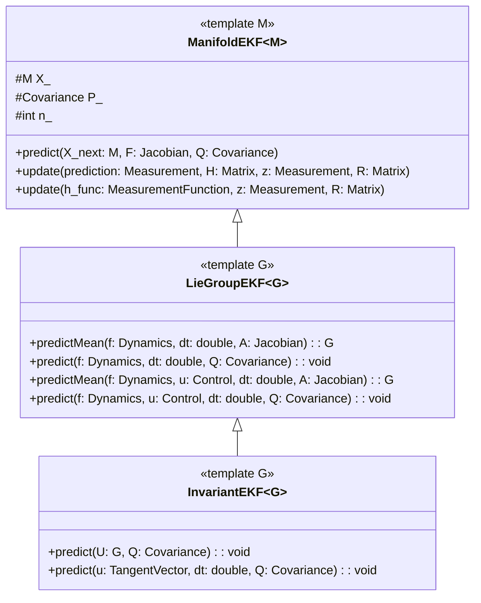

# Invariant Extended Kalman Filtering

Three classes of Extended Kalman Filters have been added to GTSAM under `navigation` to support Left Invariant Extended Kalman Filtering (LIEKFs)

## Classes


- **[ManifoldEKF](https://github.com/borglab/gtsam/blob/develop/gtsam/navigation/ManifoldEKF.h)**: Implements an EKF for states that operate on a differentiable manifold.
- **[LieGroupEKF](https://github.com/borglab/gtsam/blob/develop/gtsam/navigation/LieGroupEKF.h)**: Implements an EKF for states that operate on a Lie group with state dependent dynamics.
- **[InvariantEKF](https://github.com/borglab/gtsam/blob/develop/gtsam/navigation/InvariantEKF.h)**: Implements an EKF for states that operate on a Lie group with group composition (state independent) dynamics.

## Class Diagram





## Extended Kalman Filters
Extended Kalman Filters operate with a state  $x \in \mathbb{R}^n$ in Euclidean space. The state transition model and observation model are given by
```math
x_k = f(x_{k-1}, u_{k-1}) + w_{k-1}
```
```math
z_k = h(x_k) + v_k
```
The state of this system can be predicted using the deterministic portion of the state transition model and observation model. The covariance is predicted using the Jacobians of the state transition and observation model.
### Prediction Stage
```math
\hat{x}_{k|k-1} = f(\hat{x}_{k-1|k-1}, u_{k})
```
```math
F_k = \frac{\partial f}{\partial x}|_{k-1|k-1}
```
```math
P_{k|k-1} = F_kP_{k-1|k-1}F_k^T + Q_{k-1}
```
### Update Stage
```math
y_k = z_k - h(\hat{x}_{k|k-1})
```
```math
H_k =\frac{\partial h}{\partial x}|_{k|k-1}
```
```math
S_k = H_kP_{k|k-1}H_k^T + R_k
```
```math
K_k = P_{k|k-1}H_k^TS_k^{-1}
```
```math
\hat{x}_{k|k} = \hat{x}_{k|k-1} + K_ky_k
```
```math
P_{k|k} = (I - K_kH_k)P_{k|k-1}
```

On a manifold, these equations do not maintain the geometric structure when a state operates on a differentiable manifold.

## ManifoldEKF
The **[ManifoldEKF](https://github.com/borglab/gtsam/blob/develop/gtsam/navigation/ManifoldEKF.h)** class adapts the Extended Kalman Filter equations for states that reside on a differentiable manifold. This templated class contains the abstract predict and update steps for operating on a manifold. In this EKF, the state lies on a Manifold whereas the covariance is represented in the tangent space.

### Predict Stage
In the predict stage, the EKF equations may be propagated in two ways. If the state transition function $f$ yields a new Manifold state, then
```math
\hat{X}_{k|k-1} = f(\hat{X}_{k-1|k-1}, u_{k})
```
Otherwise, if the motion model is an increment in the tangent space, we have
```math
\hat{X}_{k|k-1} = \text{retract}(\hat{X}_{k-1|k-1}, \xi_k)
```

ManifoldEKF does not define which method is used. Rather, we simply leave it abstract such that $X_{k|k-1} = X_{\text{next}}$
where $X_{\text{next}}$ is defined by the user in their own prediction function.

### Update Stage
In the tangent space, the residual is given by
```math
y_k = \text{local}(h(\hat{X}_{k|k-1}), z_k)
```

This yields a new update increment
```math
\delta \xi_k = K_ky_k
```
and update equation
```math
\hat{X}_{k|k} = \text{retract}(\hat{X}_{k|k-1}, \delta \xi_k)
```

ManifoldEKF defines an abstract measurement model function that is inherited by LieGroup and InvariantEKF. A user defines their specific measurement function based on the template.
## LieGroupEKF
The **[LieGroupEKF](https://github.com/borglab/gtsam/blob/develop/gtsam/navigation/LieGroupEKF.h)** inherits the predict and update stages from **[ManifoldEKF](https://github.com/borglab/gtsam/blob/develop/gtsam/navigation/ManifoldEKF.h)**. This templated class is limited to states that operate on a Lie group.

This class provides predict methods for state dependent dynamics. There are four functions that are implemented in this class. The predictMean() function computes the next state $X_{\text{next}}$ and the Jacobian $F$ that depends on a state dependent dynamics function. Furthermore, there is an overload predictMean() that depends on a state dependent dynamics function and a control input $u$. These values are passed into the predict() function to utilize the EKF equations described in ManifoldEKF.

## InvariantEKF
The **[InvariantEKF](https://github.com/borglab/gtsam/blob/develop/gtsam/navigation/InvariantEKF.h)** inherits the predict and update stages from **[ManifoldEKF](https://github.com/borglab/gtsam/blob/develop/gtsam/navigation/ManifoldEKF.h)**. This templated class is limited to states that operate on a Lie group.

The InvariantEKF is a special case of the LieGroupEKF that has state independent dynamics. Specifically, this is a Left Invariant EKF. The prediction methods use group composition. Two prediction methods are introduced in this class.
Let $u$ be a tangent control vector. A Lie group increment, then, is given by $U = \exp(u \cdot dt)$, and so
```math
\hat{X}_{k|k-1} = \hat{X}_{k-1|k-1}U_k
```
The Jacobian $F$ is given by
```math
F_k = Ad_{U_{k}}^{-1}
```
The prediction method is inherited from LieGroupEKF. Two prediction methods are implemented; one with a Lie group increment $U_k$ and one with a tangent control vector $u_k$ and $dt$.


##  InvariantEKF Example on SE(2) using Lie Group increments
This demonstrates the use of an Invariant EKF with a simple odometry increment. The example is found under `examples` as **[IEKF_SE2Example](https://github.com/borglab/gtsam/blob/develop/gtsam/examples/IEKF_SE2Example.cpp)**

Let the Lie group be $\mathcal{SE}_2$, or Pose2 in GTSAM. We will use a Lie group increment as our odometry vector, and a 2D GPS measurement.

#### Defining a GPS Measurement Function
The predicted GPS measurement $h_k$ is given by the translation of the predicted state estimate. Then, the GPS measurement function is given by

```
Vector2 h_gps(const Pose2& X, OptionalJacobian<2, 3> H = {}) {
  return X.translation(H);
}
```

#### Creating and Initializing the EKF
The initial state and covariance need to be defined to create the filter.
```
  Pose2 X0(0.0, 0.0, 0.0);
  Matrix3 P0 = Matrix3::Identity() * 0.1;
```

The filter can then be created with
```
  InvariantEKF<Pose2> ekf(X0, P0);
```

For this example, we assume constant process and observation covariances. We define them as
```
  Matrix3 Q = (Vector3(0.05, 0.05, 0.001)).asDiagonal();
  Matrix2 R = I_2x2 * 0.01;
```

#### Defining odometry and measurements
We define two simple odometry steps with a Lie group increment $U$
```
Pose2 U1(1.0, 1.0, 0.5), U2(1.0, 1.0, 0.0);
```
and two GPS measurements
```
  Vector2 z1, z2;
  z1 << 1.0, 0.0;
  z2 << 1.0, 1.0;
```

#### Running the EKF
The EKF is propagated using odometry with
```
ekf.predict(U1, Q);
```

and updated using measurements via
```
ekf.update(h_gps, z1, R);
```

## InvariantEKF on NavState using a Dynamics Function
The **[IEKF_NavstateExample](https://github.com/borglab/gtsam/blob/develop/gtsam/examples/IEKF_NavstateExample.cpp)** operates on the Lie group $\mathcal{SE}_2(3)$. This example propagates the EKF using IMU measurements and a dynamics function that convert the measurements into the tangent space. The measurement is a 3D GPS measurement.

#### Defining the Dynamics
An IMU utilizes accelerometers and gyroscopes to estimate the pose of the robot. This is commonly used in inertial navigation aboard aircraft. An accelerometer and gyroscope measures the proper acceleration and the angular velocity experienced by the body. Then, $u = [a_x, a_y, a_z, w_x, w_y, w_z]^T$. In the tangent space of $\mathcal{SE}_2(3)$, we have $\xi = [w_x, w_y, w_z, 0, 0, 0, a_x, a_y, a_z]^T$. The dynamics function, then, is given by

```
Vector9 dynamics(const Vector6& imu) {
  auto a = imu.head<3>();
  auto w = imu.tail<3>();
  Vector9 xi;
  xi << w, Vector3::Zero(), a;
  return xi;
}
```

#### 3D GPS Measurement Processor
The predicted GPS measurement is simply the 3D position estimate of the current state estimate. Then,
```
Vector3 h_gps(const NavState& X, OptionalJacobian<3, 9> H = {}) {
  return X.position(H);
}
```

#### Creating and Initializing the EKF
We initialize the state and covariance, then
```
  NavState X0;  // R=I, v=0, t=0
  Matrix9 P0 = Matrix9::Identity() * 0.1;
```
and the EKF is created using
```
  InvariantEKF<NavState> ekf(X0, P0);
```

For this example, we assume constant process and observation covariances. Then,
```
  Matrix9 Q = Matrix9::Identity() * 0.01;
  Matrix3 R = Matrix3::Identity() * 0.5;
```

#### Defining IMU and GPS measurements
We define two IMU measurements and two GPS measurements. Then, the IMU is given by
```
  Vector6 imu1;
  imu1 << 0.1, 0, 0, 0, 0.2, 0;
  Vector6 imu2;
  imu2 << 0, 0.3, 0, 0.4, 0, 0;
```
and the GPS measurements are given by
```
  Vector3 z1;
  z1 << 0.3, 0, 0;
  Vector3 z2;
  z2 << 0.6, 0, 0;
```

Given that we are using control vector inputs $u$, we also need a time interval $dt$. Therefore, we describe

```
  double dt = 1.0;
```

#### Running the EKF
The prediction stage is called using
```
 ekf.predict(dynamics(imu1), dt, Q);
```

and the update stage is called using

```
  ekf.update(h_gps, z1, R);
```


