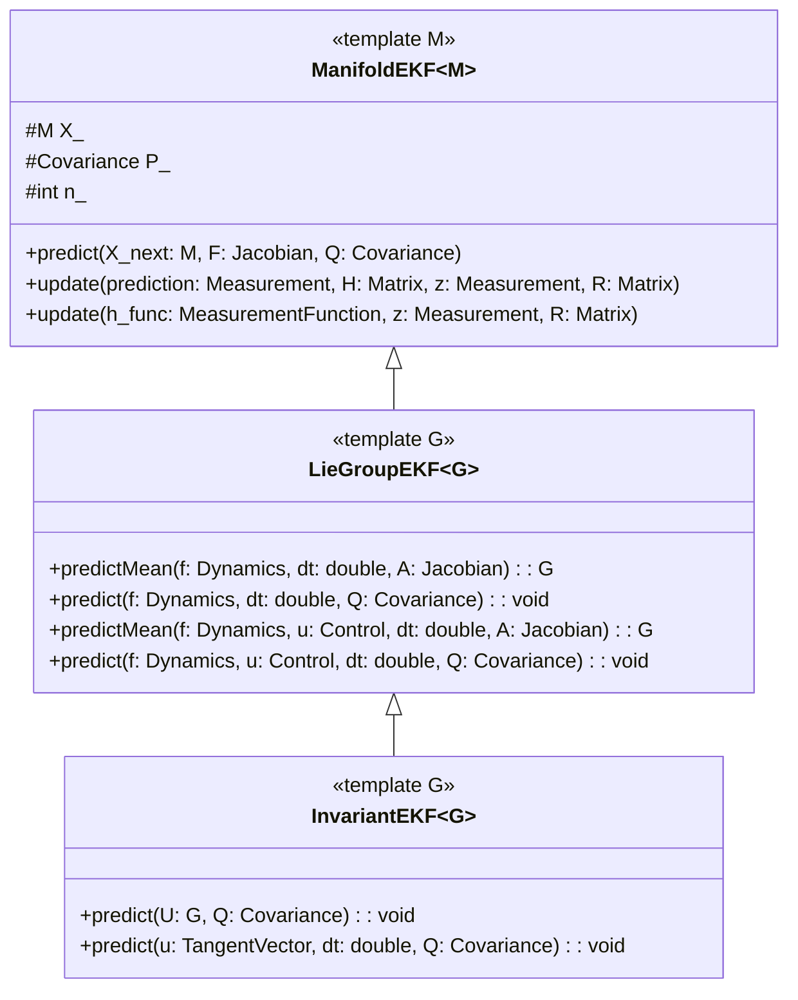

# Invariant Extended Kalman Filtering
Invariant Extended Kalman Filters (IEKFs) are a special class of Extended Kalman Filters (EKFs) that operate on states that reside on Lie Groups. They are used on a class of systems called group-affine systems where the system dynamics evolve using group composition. This group affine property allows the IEKF to have error dynamics that are **state independent**.

In a standard Extended Kalman Filter (EKF), the system dynamics are linearized around the current state estimate leading to clear state dependent dynamics. If the state estimate has error (which it always does), this linearization accumulates error as well. This characteristic can sometimes lead to poor convergence and poor performance in practice. 

This is where the IEKF sees its greatest benefits. Because of this group affine property, the error propagation is always independent of the state. Therefore, this filter will see improved convergence and consistency even with a poor state estimate. This also allows the filter to converge even with a poor initial estimate of the state. 

The Invariant Kalman Filter operates on many Lie Groups commonly used in robotics, inertial navigation, and SLAM such as  **[SO(3)](https://github.com/borglab/gtsam/blob/develop/gtsam/geometry/SO3.h)**, **[SE_2](https://github.com/borglab/gtsam/blob/develop/gtsam/geometry/Pose2.h)**, **[SE_2(3)](https://github.com/borglab/gtsam/blob/develop/gtsam/navigation/NavState.h)**. This list is not inclusive.


### Classes
To introduce the Invariant Kalman Filter to GTSAM, we have created three classes of Extended Kalman Filters under ```navigation```. GTSAM has defined many classes of Lie Groups that may be used with these filters.

- **[ManifoldEKF](https://github.com/borglab/gtsam/blob/develop/gtsam/navigation/ManifoldEKF.h)**: Implements an EKF for states that operate on a differentiable manifold.
- **[LieGroupEKF](https://github.com/borglab/gtsam/blob/develop/gtsam/navigation/LieGroupEKF.h)**: Implements an EKF for states that operate on a Lie group with state dependent dynamics.
- **[InvariantEKF](https://github.com/borglab/gtsam/blob/develop/gtsam/navigation/InvariantEKF.h)**: Implements an EKF for states that operate on a Lie group with group composition (state independent) dynamics.


Below, we introduce the math behind these filters, and provide some examples of their usage. 

## Extended Kalman Filters
Extended Kalman Filters operate with a state  $x \in \mathbb{R}^n$ in a vector space with a covariance defined in the same vector space. The state transition model and observation model are given by

```math
x_k = f(x_{k-1}, u_{k-1}) + w_{k-1} 
```
```math
z_k = h(x_k) + v_k
```
The state of this system is estimated by using the deterministic portion of the equations above. The covariance is estimated using the Jacobians of the state transition and observation model. Below are the discrete-time equations used by the Extended Kalman Filter. 
### Prediction Stage
The state of the system is predicted using the system dynamics $f$ with a control vector $u$. 
```math
\hat{x}_{k|k-1} = f(\hat{x}_{k-1|k-1}, u_{k-1})
```
The Jacobian, or state transition matrix, of the system is found at the current state estimate; then
```math
F_k = \frac{\partial f}{\partial x}|_{k|k-1}.
```
The state transition matrix is used to propagate the covariance $P$.
```math
P_{k|k-1} = F_kP_{k-1|k-1}F_k^T + Q_{k-1}
```
The state transition matrix $F_k$ is a function of the state at which it is linearized. This state dependency is the primary source of linearization errors in the EKF. 
### Update Stage
In the update stage, sensor measurements are used to update the state estimate. 

The measurement residual is given by
```math
y_k = z_k - h(\hat{x}_{k|k-1})
```
and the Jacobian of $h$, or the observation matrix, is given by 
```math
H_k =\frac{\partial h}{\partial x}|_{k|k-1}
```
Once again, we linearize around the current state estimate; therefore, we have another source of linearization errors in the EKF. 

The residual covariance is given by
```math
S_k = H_kP_{k|k-1}H_k^T + R_k
```
and the Kalman gain is given by
```math
K_k = P_{k|k-1}H_k^TS_k^{-1}
```
Finally, the state and covariance are updated with
```math
\hat{x}_{k|k} = \hat{x}_{k|k-1} + K_ky_k
```
```math
P_{k|k} = (I - K_kH_k)P_{k|k-1}(I - K_kH_k)^T + K_kR_kK_K^T
```
This covariance update equation is the "Joseph form" which is used for increased numerical stability.

On a manifold, these equations do not maintain the geometric structure when a state operates on a differentiable manifold. 

## ManifoldEKF
The **[ManifoldEKF](https://github.com/borglab/gtsam/blob/develop/gtsam/navigation/ManifoldEKF.h)** class adapts the Extended Kalman Filter equations for states that reside on a differentiable manifold. This class provides a *predict* function that is dependent on the specific motion model and a templated *update* method. In this EKF, the state $X$ lies on the manifold, and the covariance $P$ is found in the tangent space at $X$. 


### ManifoldEKF Predict Stage

In the ```ManifoldEKF``` predict stage, the EKF equations may be propagated in two ways. If the state transition function $f$ directly yields a new state on the manifold, then
```math
\hat{X}_{k|k-1} = f(\hat{X}_{k-1|k-1}, u_{k})
```
Otherwise, if the motion model is an increment $\xi_k$ in the tangent space, then 
```math
\hat{X}_{k|k-1} = \text{retract}(\hat{X}_{k-1|k-1}, \xi_k)
```

ManifoldEKF does not define which method is used. Rather, we such that $X_{k|k-1} = X_{\text{next}}$
where $X_{\text{next}}$ is defined by the user in their own prediction function. This allows the method to be flexible to any motion model. 

### ManifoldEKF Update Stage
In the tangent space, the residual is given using the local chart; then  
```math
y_k = \text{local}(h(\hat{X}_{k|k-1}), z_k)
```

This yields a new update increment in the tangent space $\delta \xi_k$ where
```math
\delta \xi_k = K_ky_k
```
and the state is updated via the retract operation 
```math
\hat{X}_{k|k} = \text{retract}(\hat{X}_{k|k-1}, \delta \xi_k)
```

```ManifoldEKF``` contains two ```update``` overloads. One ```update``` takes in a measurement model with $h$ and computes its Jacobian $H$. The second version takes in $h$ and a pre-computed Jacobian $H$.

The ```LieGroupEKF``` and ```InvariantEKF``` inherit the predict and update logic from this code. 

## LieGroupEKF
The **[LieGroupEKF](https://github.com/borglab/gtsam/blob/develop/gtsam/navigation/LieGroupEKF.h)** is a specialization of **[ManifoldEKF](https://github.com/borglab/gtsam/blob/develop/gtsam/navigation/ManifoldEKF.h)** for states that reside on a Lie group with **state dependent dynamics**. This class inherits the ```update``` logic from ```ManifoldEKF``` and implements the ```predict``` function for state dependent dynamics.

This class implements two overloaded functions ```predictMean()``` and ```predict()```. The ```predictMean()``` computes the next state estimate and state transition Jacobian $A$, whereas ```predict()``` takes in that state estimate and computes the covariance estimate. 

In ```predictMean()``` the motion model $f$ is passed into the function; then, the tangent space increment is given by

```math
\xi_k = f(\hat{X}_{k-1|k-1}, u_{k-1})
```
and the motion increment is given by 
```math
U_k = \text{Expmap}(\xi_k * \Delta t)
```
The state is then updated using group composition; then
```math
\hat{X}_{k|k-1} = \hat{X}_{k-1|k-1}U_k
```
These functions also compute the full state transition Jacobian $A$ which is state dependent. This ```predictMean()``` passes this onto the ```predict()``` function. 

Overloaded functions of ```predictMean()``` and ```predict()``` also allows the user to pass in their own computed Jacobian $A$. 

This class is useful for generic extended Kalman filtering on Lie Groups; however, it does not have the benefits of the IEKF.

## InvariantEKF

The **[InvariantEKF](https://github.com/borglab/gtsam/blob/develop/gtsam/navigation/InvariantEKF.h)** further specializes the **[LieGroupEKF](https://github.com/borglab/gtsam/blob/develop/gtsam/navigation/LieGroupEKF.h)** for systems that reside on a Lie group with **state independent dynamics**. It inherits the update logic from ```LieGroupEKF```. 

This class implements the **Left Invariant Extended Kalman Filter** where the prediction methods use group composition. 
Let $u$ be a tangent control vector. A Lie group increment, then, is given by $U = \exp(u \cdot \Delta t)$, and so
```math
\hat{X}_{k|k-1} = \hat{X}_{k-1|k-1}U_k
```
The Jacobian $F$ is given by
```math
F_k = Ad_{U_{k}}^{-1}
```

```InvariantEKF``` implements an overloaded ```predict()``` method. One method calls a Lie group increment $U$ directly, whereas the second overload takes in a tangent control vector $u$ and a time interval $dt$ where $U = \exp(u \cdot \Delta t)$.


##  InvariantEKF Example on SE(2) using Lie Group increments
This demonstrates the use of an Invariant EKF with a simple odometry increment. The example is found under `examples` as **[IEKF_SE2Example](https://github.com/borglab/gtsam/blob/develop/gtsam/examples/IEKF_SE2Example.cpp)**

Let the Lie group be $\mathcal{SE}_2$, or Pose2 in GTSAM. We will use a Lie group increment as our odometry vector, and a 2D GPS measurement.

#### Defining a GPS Measurement Function
The predicted GPS measurement $h_k$ is given by the translation of the predicted state estimate. Then, the GPS measurement function is given by

```
Vector2 h_gps(const Pose2& X, OptionalJacobian<2, 3> H = {}) {
  return X.translation(H);
}
```

#### Creating and Initializing the EKF
The initial state and covariance need to be defined to create the filter.
```
  Pose2 X0(0.0, 0.0, 0.0);
  Matrix3 P0 = Matrix3::Identity() * 0.1;
```

The filter can then be created with
```
  InvariantEKF<Pose2> ekf(X0, P0);
```

For this example, we assume constant process and observation covariances. We define them as
```
  Matrix3 Q = (Vector3(0.05, 0.05, 0.001)).asDiagonal();
  Matrix2 R = I_2x2 * 0.01;
```

#### Defining odometry and measurements
We define two simple odometry steps with a Lie group increment $U$
```
Pose2 U1(1.0, 1.0, 0.5), U2(1.0, 1.0, 0.0);
```
and two GPS measurements
```
  Vector2 z1, z2;
  z1 << 1.0, 0.0;
  z2 << 1.0, 1.0;
```

#### Running the EKF
The EKF is propagated using odometry with
```
ekf.predict(U1, Q);
```

and updated using measurements via
```
ekf.update(h_gps, z1, R);
```

## InvariantEKF on NavState using a Dynamics Function
The **[IEKF_NavstateExample](https://github.com/borglab/gtsam/blob/develop/gtsam/examples/IEKF_NavstateExample.cpp)** operates on the Lie group $\mathcal{SE}_2(3)$. This example propagates the EKF using IMU measurements and a dynamics function that convert the measurements into the tangent space. The measurement is a 3D GPS measurement.

#### Defining the Dynamics
An IMU utilizes accelerometers and gyroscopes to estimate the pose of the robot. This is commonly used in inertial navigation aboard aircraft. An accelerometer and gyroscope measures the proper acceleration and the angular velocity experienced by the body. Then, $u = [a_x, a_y, a_z, w_x, w_y, w_z]^T$. In the tangent space of $\mathcal{SE}_2(3)$, we have $\xi = [w_x, w_y, w_z, 0, 0, 0, a_x, a_y, a_z]^T$. The dynamics function, then, is given by

```
Vector9 dynamics(const Vector6& imu) {
  auto a = imu.head<3>();
  auto w = imu.tail<3>();
  Vector9 xi;
  xi << w, Vector3::Zero(), a;
  return xi;
}
```

#### 3D GPS Measurement Processor
The predicted GPS measurement is simply the 3D position estimate of the current state estimate. Then,
```
Vector3 h_gps(const NavState& X, OptionalJacobian<3, 9> H = {}) {
  return X.position(H);
}
```

#### Creating and Initializing the EKF
We initialize the state and covariance, then
```
  NavState X0;  // R=I, v=0, t=0
  Matrix9 P0 = Matrix9::Identity() * 0.1;
```
and the EKF is created using
```
  InvariantEKF<NavState> ekf(X0, P0);
```

For this example, we assume constant process and observation covariances. Then,
```
  Matrix9 Q = Matrix9::Identity() * 0.01;
  Matrix3 R = Matrix3::Identity() * 0.5;
```

#### Defining IMU and GPS measurements
We define two IMU measurements and two GPS measurements. Then, the IMU is given by
```
  Vector6 imu1;
  imu1 << 0.1, 0, 0, 0, 0.2, 0;
  Vector6 imu2;
  imu2 << 0, 0.3, 0, 0.4, 0, 0;
```
and the GPS measurements are given by
```
  Vector3 z1;
  z1 << 0.3, 0, 0;
  Vector3 z2;
  z2 << 0.6, 0, 0;
```

Given that we are using control vector inputs $u$, we also need a time interval $dt$. Therefore, we describe

```
  double dt = 1.0;
```

#### Running the EKF
The prediction stage is called using
```
 ekf.predict(dynamics(imu1), dt, Q);
```

and the update stage is called using

```
  ekf.update(h_gps, z1, R);
```


## Class Diagram





